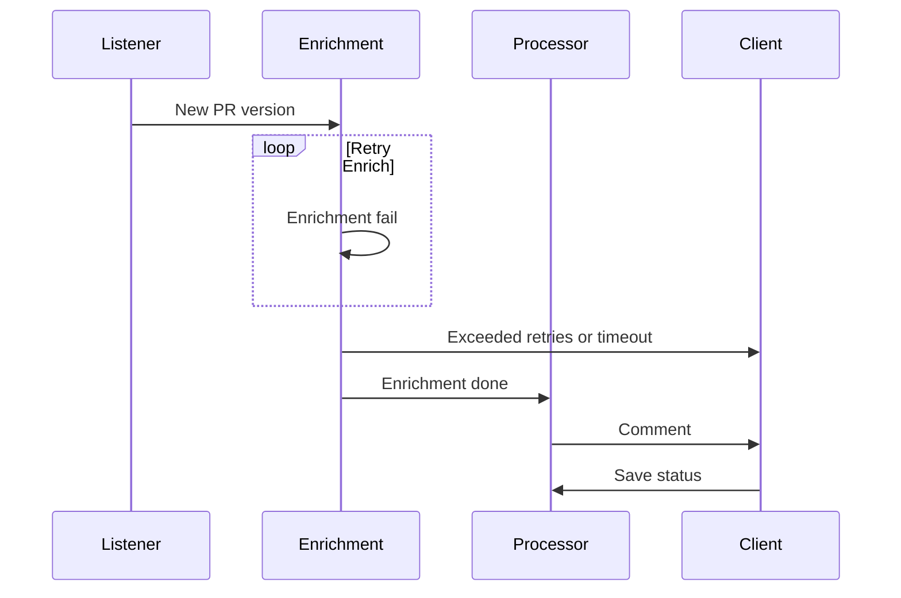

# Fairy

Improve your PR review experience.

从 Toby 老师那里“窃”来的创意（读书人的事，怎么能叫偷呢🤣）。开始做的时候，条件已经不允许我拿现成的代码作参考了，只能凭记忆把主要功能复刻一下，细节上会少很多东西。

## 模块

- Listener：监听 PR，处理 webhook
- Service：处理 PR 数据，生成评论
- Intelligence：AI 代码审查
- Common：通用类
- External：集成外部服务

原本应该是几个分开的 repo，但是为了自己写的时候少切项目，干脆放在一起。（之后可能改成子项目的形式吧，那样管理 property 会方便点？）

~~还应该有 Proxy 等模块，但是我自己的 demo 应该不会涉及像多个 VCS instance 这样的需求，所以只大概分了上面几个模块。~~

## 时序图 test

## 一些闲话

原型是用 Java 写的，所以顺着惯性，我还是用了 Java 这一套。决定要复刻这么一个 demo 的时候想过要不干脆用 Rust/Go 来做，顺便提升一下我那可怜的熟练度，但是随着时间过去，我发现自己开始忘记这个项目里面需要有什么（这也要怪我一开始没有画架构图什么的），所以还是用了 Java。
