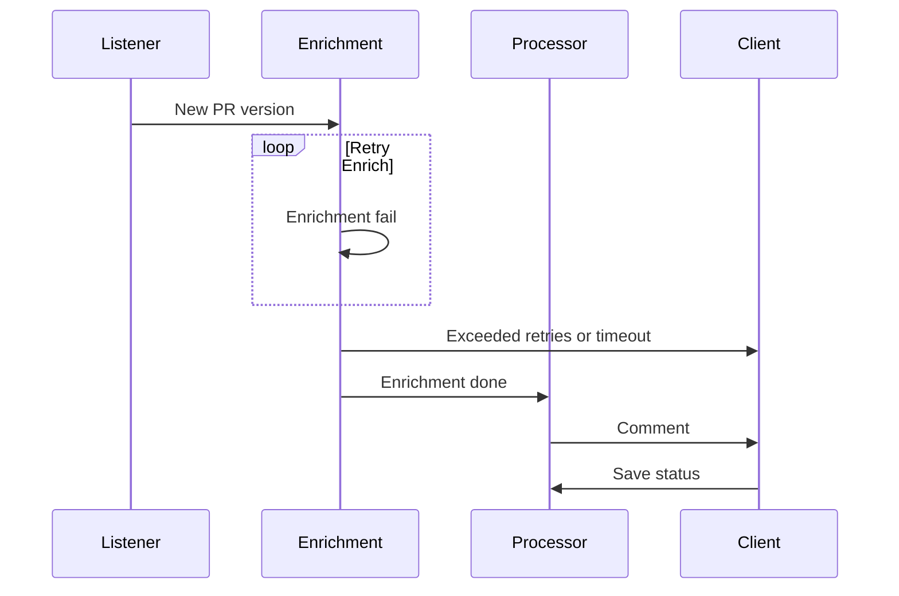

# fairy

从 Toby 老师那里“窃”来的创意（读书人的事，怎么能叫偷呢……）

## 时序图 test

```mermaid
sequenceDiagram
    participant Listener
    participant Enrichment
    participant Processor
    participant Client
    Listener->>Enrichment: New PR version
    loop Retry Enrich
        Enrichment->>Enrichment: Enrichment fail
    end
    Enrichment->>Client: Exceeded retries or timeout
    Enrichment->>Processor: Enrichment done
    Processor->>Client: Comment
    Client->>Processor: Save status
```
